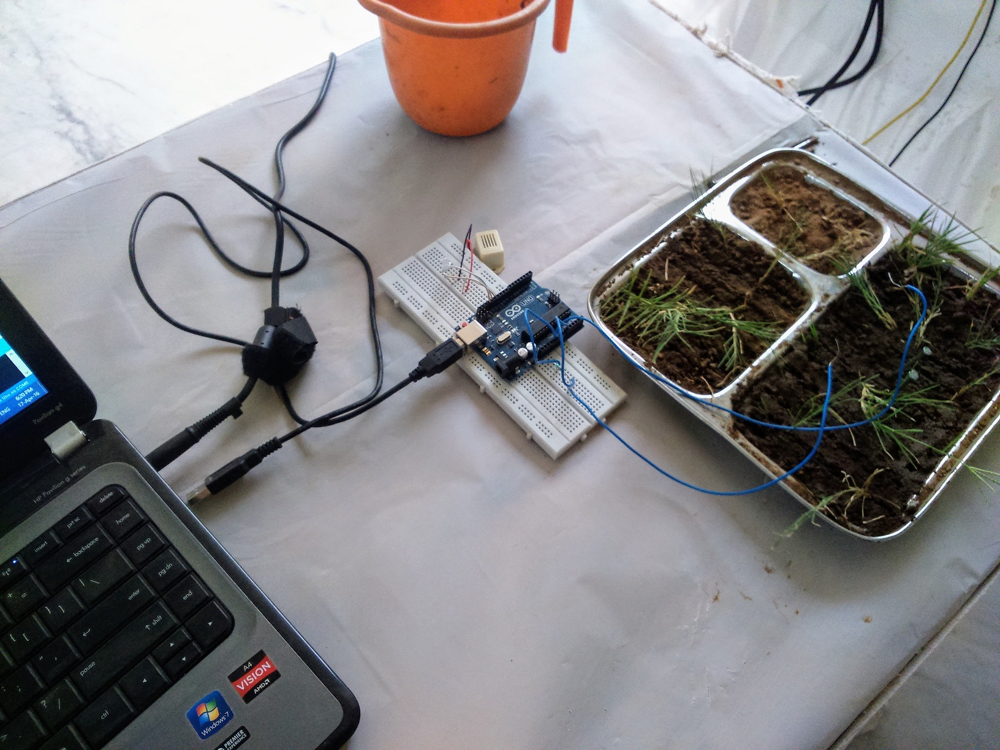

# Little Groot 
## About Project
* Name inspired from Guardian of Galaxy Movie Character
* So we started with the basic i.e. most important plant **water requrement**. 
The plant monitor has a moisture sensor that measures how wet your plant’s soil is and in turn tells you how thirsty it is. 
If the plant needs watering, an LED lights up and blink until the plant’s been watered along with buzzer, 
and the string “Feed me! Feed me, I am dying” is sent to your computer.
When the plant has been watered sufficiently, the LED switches off and the string “Thank you, Team!” is sent once to your computer. 
If the plant does not get sufficient water, It will keep on the led and send the message " I need more water" to the computer and smartphone.
There are three conditions in it according to normal plant water requirement and their corresponding output.
In case of no water
In case of Little Water
In case of More Water

* It also detects the **upcoming creatures** around it and will start buzzer sound to send them away. It will also notify its owner about it.
* It will detect the **pH level** of the soil and will tell its master about its condition.

## Future Prospect
This version of program is for normal plant and in future it will be created for different types of plant according to their water requirement.

## Files
* [ppt](https://github.com/vijaypurohit/Little-Groot/blob/master/Little%20Groot.pptx)

#### Idea From
* Head First C: Arduino Lab

